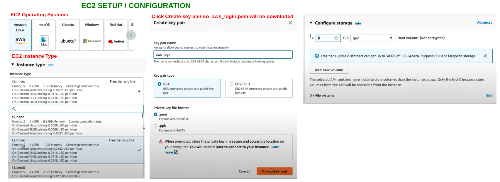
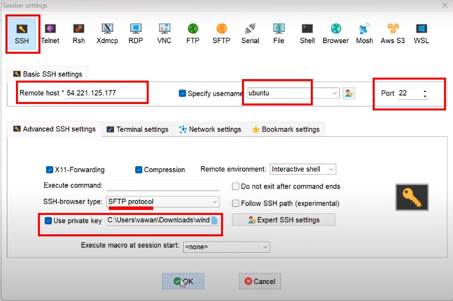
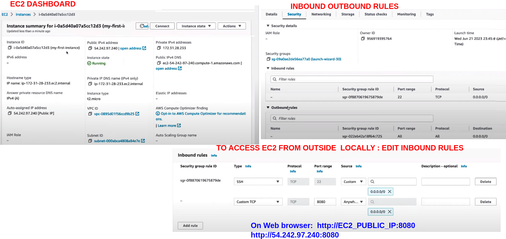

<pre> 

EC2 service 
Elastic Cloud Compute : Provides you a virtual server .
Compute instance : privides you CPU , RAM , Disk .
Elastic : Service can be Scaled up or down.

Here are the main five types of Amazon EC2 instances described : 
    1 General Purpose Instances: Balanced compute, memory, and networking resources for diverse workloads.
    2 Compute Optimized Instances: High-performance processors for compute-bound applications, ideal for 
      batch processing and high-performance web servers.
    3 Memory Optimized Instances: Fast performance for memory-intensive workloads, suitable for high-performance 
      databases and real-time big data analytics.
    4 Storage Optimized Instances: Designed for high, sequential read/write access to large data sets, perfect 
      for data warehousing and log processing applications.
    5 Accelerated Computing Instances: Hardware accelerators for efficient processing of tasks such as machine
      learning and computational fluid dynamics
</pre>

<h1> EC2 SETUP </h1>

<h1> SSH TO EC2 from your Linux (Ubuntu)PC to get logged into instance  </h1>

<pre> 
<h4> PEM FILE  </h4>
    
    1)Go to downloded PEM file location  and give permisssion to it 
     Use :   chmod 600 aws_login.pem

    2) USe the shh command 
     ssh -i /path_to_your_key/your_pem_filename.pem your_user@your_ec2_public_ip

     to get  your_user run command :  whoami
      
</pre> 

<h1> Connect TO EC2 from your Windows PC to get logged into instance  </h1>
<pre>
    Can be done in 2 ways :
    1) PUTTY
    2) MOBAXTERM

    LETS SEE VIA MOBAXTERM

    
</pre> 

<pre>

<h1> ACCESS EC2  PORT FROM WEBROWSER OR FROM OUTSIDE </h1>

</pre>
