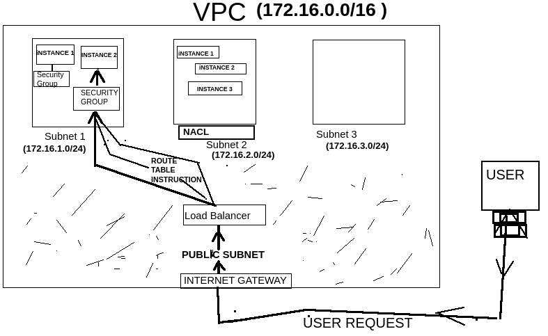
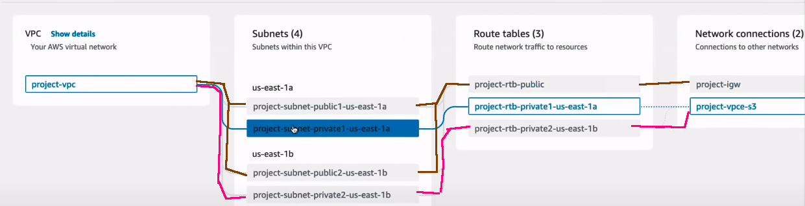

<pre>
<h1>VIRTUAL PRIVATE CLOUD (VPC)</h1>
Devops ENGINEER  CREATRE A VPC TO ALLOCATE SPECIFIC IP ADDRESS RANGE TO OUR PROJECTS
FOR SECURITY PURPOSES. So FOR VPC size - AWS asks for IP Address Ranges.

 Now you big projects may have subprojects (Dev ,Test,Other etc): so we will split 
 ip address ranges again called – Subnets.The subnets can be public and private.

 Devops ENGINER WILL CREATE A GATEWAY .As without gateway we wont be able to
 access the VPC. 

 In VPC we have free space (COMMON SUBNET )called Public Subnet . And internet gateway 
 provide access to it .

As we create VPC , By Deafult aws creates
 
    • <B>INTERNET Gateway </B>: Is an entry point to VPC. This allows instances in the default
       public subnet to communicate with the internet(Outgoing Requests) and allows incoming 
       request to VPC into Public subnet via internet. 
      
    • <B>NACL (Network Access Control List )</B> :  provides security a subnet level Of VPC. It has 
       Both Configuration - Deny and Allow feature for requests. All inbound and 
       outbound traffic is denied by default.(Go to VPC service --> Security -> Network ACLs)
 
    • <B>Security Group</B>: A default security group is created and associated with the VPC. 
       All inbound traffic is denied by default and allows all outbound traffic.
       Security – has Only Allow Feature. So we cannot used Deny feature here.
 
    • <B>Route Table </B>:A main route table is created for the VPC, and all subnets are 
      associated with this route table by default. WHICH DEFINES PATH HOW REQUEST MUST GO TO Instances
      FROM LOAD BALANCER.
 
    • <B>Default Subnet </B>: One default subnet is created in each Availability Zone within the VPC.
      These subnets are public by default.

      

    • NACL is firstlayer defence  at Subnet level 
    • Security Group is final level defnece at instance level

     <B>ELASTIC  Load BALANCER </B>: IS ATTACHED TO public Subnet .As load balancer is created AWS allocates 
      IP address to it.It forward the request depending upon the load  at Instances .
 
   • <b> TARGET GROUP </b> :   For LOAD BALANCVER WE WILL CREATE A TARGET GROUP
 
      AT INSTACES(ec2)level Also WE HAVE SECURITY GROUPS

    <B> NAT GATEWAY Conept</B>:  we dont want the User to know the private ip of our EC2 instaces we do maskinng 
    of IP Address by NAT gatways . It will mask or change the private adress Of EC2 to Public ip address of load 
    balancer(Called as SNAT) or router(THen called as NAT).So WE CRATE NAT gateway in public Subnet .

    VPC can have both public and private Subnet. Generally in private subnet we have Applicatoin /Insatances and 
    In in public we have Load balancer+NAT gateway.   

   
    
</pre>
<pre>
<h1></h1>
    <h4></h4>
</pre>

<pre>
<h1></h1>
    <h4></h4>
</pre>
